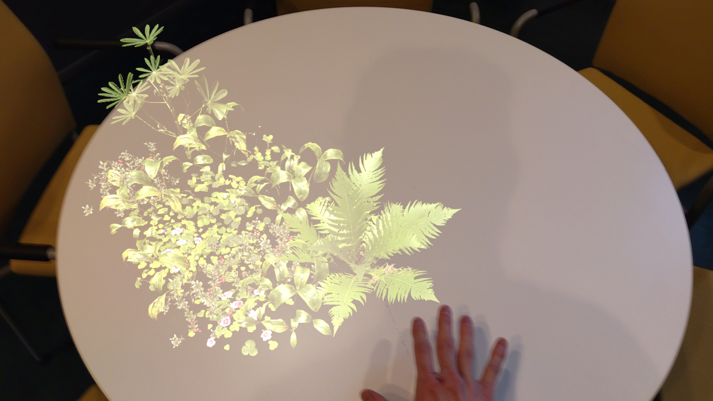

# Final Project Report

## Weeds

*An interactive AR/MR experience in which you can grow plants on the surfaces around you.*



The viewer can hover their hand over a surface to have random plants grow on it. The plants are a mix of native plants (violets, ferns, chamomile, lingonberries, lilies of the valley) and invasive plant species (lupine).

***ALL plant assets are from [Quixel Megascans](https://quixel.com/megascans/home)***

## General Thoughts

Whatever [artistic idea](/docs/final-project-proposal) I had at the beginning of the project quickly got thrown aside once I realized that even getting the scene understanding capabilities of the Hololens to work was quite challenging. I did, however, like the idea of growing plants when touching objects, so I stuck with that part.

As for the final product, I do like the interaction and I think it is quite fascinating to interact with the space around you to see what could be. My main goal was to explore augmented reality design & development in preparation for my master’s thesis, and I do think that I succeeded mostly in that.

## Technical Notes

The experience was built for the Microsoft Hololens 2 using Unreal Engine 5.1.1. The main reasons I chose Unreal over Unity were the supposedly more approachable visual programming system and free access to some of the assets from Quixel.

[Scene understanding](https://learn.microsoft.com/en-us/windows/mixed-reality/design/scene-understanding) is used to dynamically detect surfaces around the viewer, which means that the application is independent of the space the device is in.

The final result is running on the device itself. I adjusted the assets' level of detail (LOD) to find a balance between looking good and not being overly detailed. Otherwise, the project settings mostly follow [Microsoft's recommendations](https://learn.microsoft.com/en-us/windows/mixed-reality/develop/unreal/performance-recommendations-for-unreal). The [chessboard tutorial](https://learn.microsoft.com/en-us/windows/mixed-reality/develop/unreal/tutorials/unreal-uxt-ch1) provides some information on how to set your project up, but the UXTools plugin has not been updated for Unreal 5 as of writing this and *will not work as-is*! Thankfully, it is not required to create something like this project (minus the hand "menu" seen in the video).

> Interested in doing something like this yourself? Then you probably have run into Microsoft's abysmal documentation. I've collected some (hopefully helpful) scene understanding pointers [on a separate page](/docs/hololens-scene-understanding).

## Insights on the Hololens

Finally, a few general insights on the Hololens.

- Clearly designed for some imaginary “average” person; when I let a shorter-than-average-adult friend of mine try to use the device, the interface elements were consistently placed too far for them to reach while stationary.
  
- The screens are not only not uniform in luminance and color, they also have differ from each other. This did not bother me when using the headset for short periods of time, but I can see this being a significant strain-causing factor over longer sessions.

- That said, I think it already has fairly good ergonomics in terms of weight and balance. Personally, my biggest issue with the device is the very limited field of view.

- The operating system handles spatial tracking really well. Windows do not flicker, stutter or move when you do.

- First build takes a LONG time. This is not necessarily Hololens related, but should be kept in mind nonetheless. Do not leave your build & deploy until the last minute!