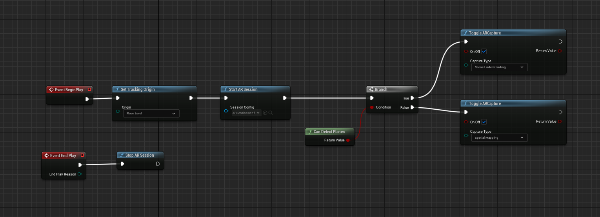
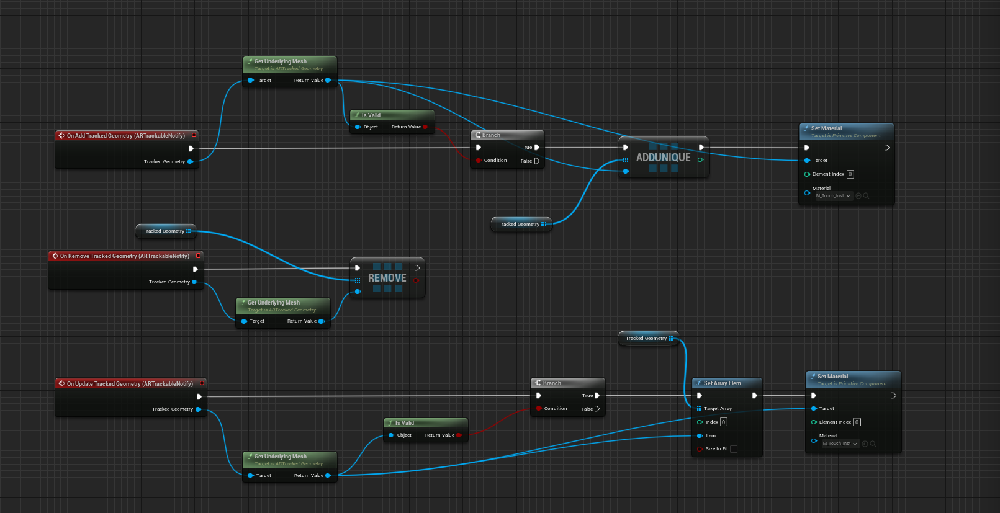
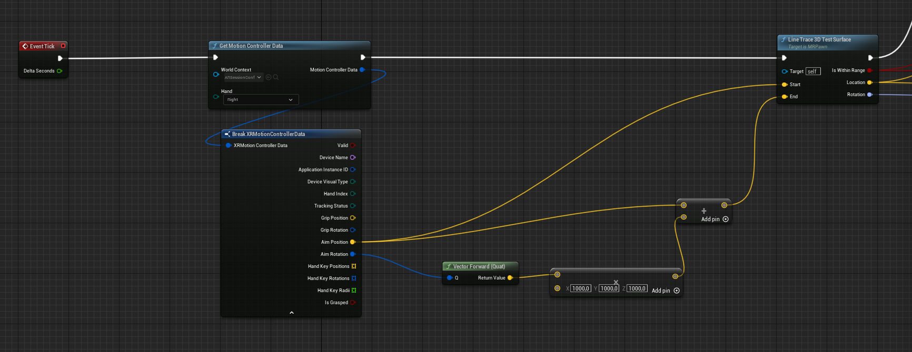
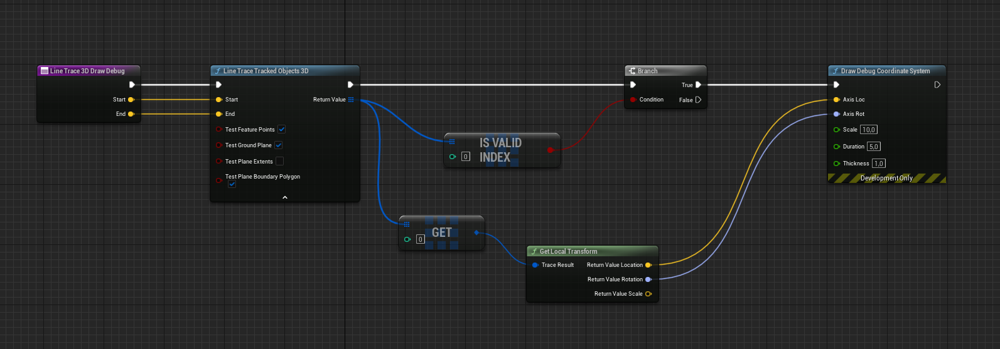
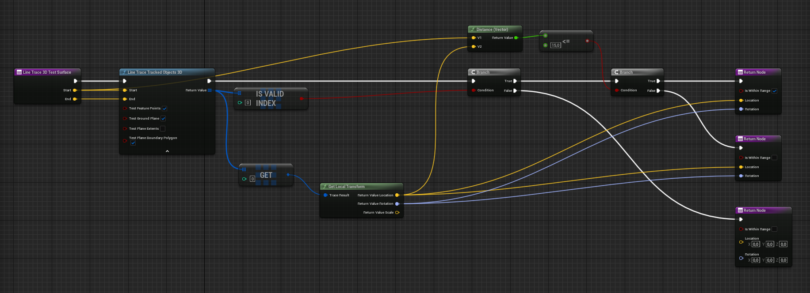
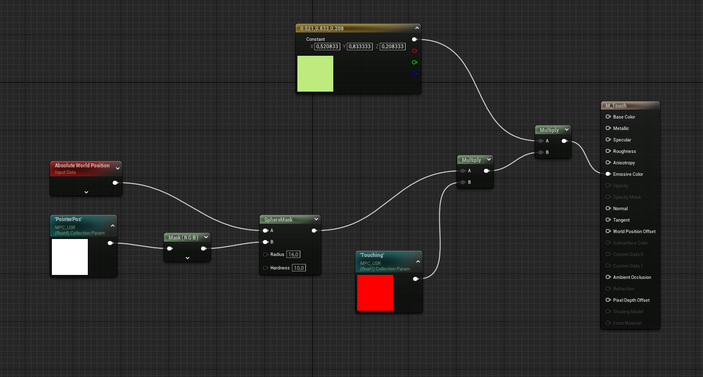

# Scene Understanding with Hololens 2 & Unreal

> Right-click and open image in a new tab to see the full resolution images.

## Enabling Scene Understanding

You can follow the setup instructions on [Microsoft's page](https://learn.microsoft.com/en-us/windows/mixed-reality/develop/unreal/unreal-scene-understanding) to enable scene understanding in your project.

At the bottom of the page linked above, they also show a blueprint to set different materials depending on the types of surfaces detected. In my experience, this is not stable at all - the planes tend to flicker in and out of existence as the scene mesh is updated. This does not mean that the planes themselves cannot be used to do other things, like ... spawning stuff, like I did with this project.

Here's my level blueprint to enable mixed reality functionality and scene understanding:



Then, I created a separate blueprint actor (with ARTrackableNotify as in the linked instructions) that represents the scene mesh:



This blueprint I adapted from the Unreal Engine Hololens 2 [course chapter on spatial mapping](https://dev.epicgames.com/community/learning/courses/M97/hololens-2-mixed-reality-production-for-unreal-engine/LBo/unreal-engine-spatial-mapping) (a good starting place, but unneccessarily complex for my use case).

By using an array, only valid meshes are updated with the desired material. Note that I'm only using one material for all types of surfaces here, but you could still use the system Microsoft's documentation shows.

> Note that setting materials requires the use of the ARTrackableNotify component, which is available as a part of the UXTools plugin - which, if you read the final report, is not currently available as-is for Unreal 5. However, you can still do things that involve calculations against the surfaces without it!

## Checking Distance Between Hand & Surface

If you looked at Microsoft's documentation linked above, at the bottom of the page you'll have seen a blueprint without much context on how to use it. 

Effectively, what needs to be done to check for collision between your hand and the spatial mesh is:

1. Find out the position of your hand
2. Find out the direction your hand is pointed at
3. Find out where the intersection between a straight line drawn from your hand to the wall your hand is pointed at is
4. Check if the distance between your hand & that point is small enough

### How It's Done

The following blueprints should be placed on your player actor (pawn). You also should have the Microsoft OpenXR plugin installed in your project. If you're unsure about either of these things, follow Microsoft's [quickstart](https://learn.microsoft.com/en-us/windows/mixed-reality/develop/unreal/unreal-quickstart).



First, we need the position and rotation of your hand. This is done here for the right hand using the `GetMotionControllerData` and `BreakXRMotionControllerData` nodes. We then also calculate a vector that is 1000 units long pointed in the direction your hand is pointing in.

The position of your hand and this newly calculated vector are then set as the parameters for a custom function I have called `LineTrace3DTestSurface` (function blueprint below).

Now, we can calculate the position where the hand ray intersects with the spatial mesh and draw something there. This is just a cleaned up version of the example on Microsoft's page you have seen by now:



In this case, rotation is also calculated so that the resulting rotator's x-axis is always pointing in the direction of the surface's tangent (as seen in [project report #3](/embodied-interaction-dir/docs/project-report-3)).

This can then be extended to check the distance between the hand and the wall:



Rather than drawing the debug axis in the intersection position, I now check if the hand is within 15 units (roughly 5cm in my experience) from the surface. Finally, the location and rotation of the intersection are returned along with a boolean value representing whether the hand is close enough to the surface.

You can then use these values as you please. For example, I used the `isWithinRange` boolean to determine whether plants should be spawned and the `location` and `rotation` outputs to determine where those plants should be spawned and to orient them so that they grow outwards from the surface.

## Reactive Material

Performance-wise, this probably is not the best solution as updating a material on the fly is pretty costly! A better solution would be to simply spawn a plane with a static material with a circle texture and move that around.

That said, here's the dynamic material solution that I used for this project.



```PointerPos``` and ```Touching``` are collection parameters that are set externally. ```PointerPos``` is a 4-dimensional vector (of which only the 3 first dimensions are used) that indicates the position of the intersection position (`location` output from the previous function). ```Touching``` varies between values 0 and 1 and indicates whether the tracked hand is close enough to a surface (`isWithinRange` from the previous function). The ```Absolute World Position``` node refers to the position of the object the material is set to.