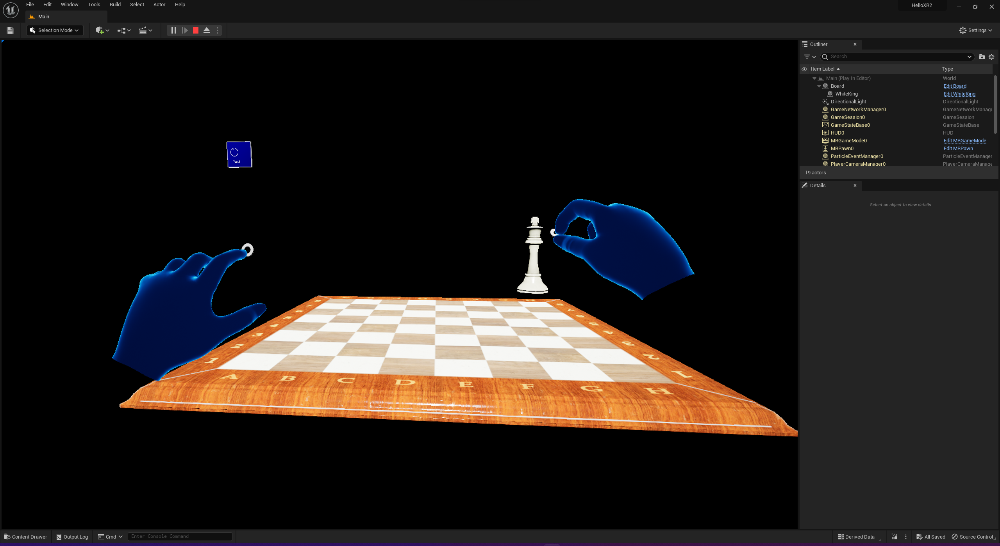

# Project Week 1 Report

## Choosing the Tools

While I had worked with a couple of game engines before (namely, Godot and Gamemaker), I had not worked with either Unity or Unreal (both of which are officially supported by Microsoft for Hololens development).

*...so why did I choose Unreal?*

The general consensus online seemed to be that its node-based visual programming system was more approachable than Unity's equivalent. And if you know how little I enjoy writing code, you will also know that this is more than enough to make me pick one tool over another (even though I dread the day I might have to use C++ rather than C#). An added bonus is the free access to some of the materials / textures / assets from [Quixel](https://quixel.com/megascans/home/).

## Getting My Bearings

I began my journey by following Microsoft's [Unreal development tutorial](https://learn.microsoft.com/en-us/windows/mixed-reality/develop/unreal/tutorials/unreal-uxt-ch1) where you build a scene with a chessboard and a chesspiece which can be manipulated (moved, scaled, rotated) using hand gestures.

Quite a bit of configuration (including having to re-build the UXTools plugin*) was required in order to get the scene to run on device. After everything was set up though, building the scene turned out not to be rocket science, even if the tutorial materials were based on an earlier version of Unreal. I am, in fact, **very** surprised how easy this was.

Having completed the tutorial, I delved deeper into Unreal by just trying things out. I spent (too much) time fiddling with the material system, made a ball that has physics and can be picked up and, more relevant to my project idea, created a couple of walls that can be touched to spawn other objects.

Of course, if you - unlike me - have used game engines before, nothing about this is impressive.

I also tried out tracking a QR code, but this would not work as I was streaming the game from my computer to the Hololens rather than deploying it on the device itself (as mentioned in passing on [this](https://learn.microsoft.com/en-us/windows/mixed-reality/develop/unreal/unreal-hololens-camera?tabs=426) page, the camera API is NOT available when remoting).

---

\* I'll do a full write-up of the setup process at some point!