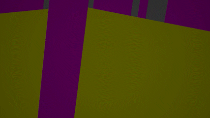

# Project Weeks 2 & 3

Weeks 2 and 3 were largely unproductive. I did spend quite a bit of time trying to get the scene understanding capability working, but the documentation was quite lacking and the visualization of meshes was far from the stable utopia that [microsoft’s own videos presented](https://learn.microsoft.com/en-us/windows/mixed-reality/design/scene-understanding). Rather, everything was flickering as seen below:

As for why I began experimenting with spatial mapping, I figured out quite quickly after getting my bearings with Unreal that I was not going to achieve the full idea that I presented; Learning to use a game engine and develop someting for AR is a big enough challenge not even considering machine vision.

Instead, I developed my idea further in the plant-growing direction. The viewer/user could touch different surfaces in the space around them with different kinds of plants beginning to sprout from the touched surfaces. I felt that this would still make for an interesting physical interaction between the viewer and the space they are located in.

Needless to say, by the end of week 3, I felt quite discouraged.