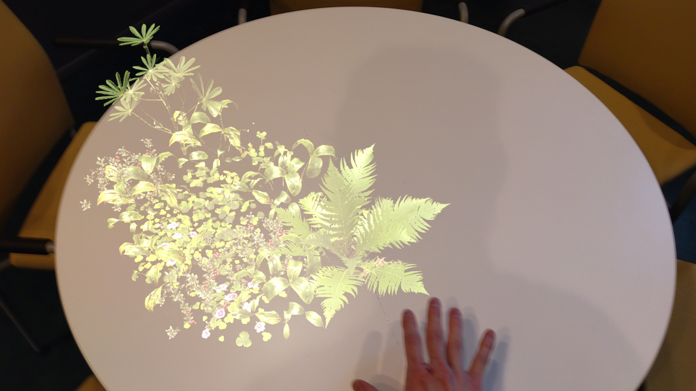

# Project Weeks 4 & 5

## Simplifying the Idea

After the obstacles I faced during weeks 2 and 3, I had almost completely given up on trying to get the spatial mapping to work. I continued to flesh out the fern-planting idea that I had played with during the first week, making the interaction so that the user has to hold their hand on the interaction surface to gradually grow more plants. I also spent a lot of time figuring out how to animate the material under the user’s hand.

After a bit of trial and error, I had a vertical surface that could display waves when touched (and the waves would follow the user's hand!) and spawn ferns randomly around the point touched.

## One More Time

But I felt that the interaction was quite lacking without the physical aspect to it (the interaction area here was just a floating plane). I thought about using a QR code to place the plane in the real world, but that did not feel like it would create an adequate connection between the viewer and the space.

And after a few hours of going through every little detail in the documentation, browsing github issues and bashing my head against the wall, I did figure out how to get the debug axes to be drawn on any detected surfaces!

## Back on Track

Putting together the rest of the project was (comparatively) straightforward. I had already made the touch-reactive material, so all I had to do was to apply it to the scene understanding meshes as the headset detects them.

To add more variation to the plants, I added more assets from [Quixel](https://quixel.com/) (all plant assets within the project are from there as they have a free license when used with unreal).

## The Final Hurdle

Until now, I had worked with the Hololens by [streaming](https://learn.microsoft.com/en-us/windows/mixed-reality/develop/unreal/unreal-streaming?tabs=wmr) the project from my desktop over wlan. To actually be able to demo the project, I had to [deploy it](https://learn.microsoft.com/en-us/windows/mixed-reality/develop/unreal/unreal-deploying) onto the device itself. Deploying from Unreal was in itself easy after [setting up the device portal connection](https://learn.microsoft.com/en-us/windows/mixed-reality/develop/advanced-concepts/using-the-windows-device-portal) (also very simple).

The issues started when I tried to actually run the deployed application on the device. Performance was poor even after following Microsoft's own [performance recommendations](https://learn.microsoft.com/en-us/windows/mixed-reality/develop/unreal/performance-recommendations-for-unreal).

Initially I suspected that the culprit was - once again - scene understanding, but that actually turned out not to be the case. The translucency of the plants' materials were not the problem either, even though the recommendations explicitly tell to avoid translucent and masked materials in Unreal.

As it turns out, it was the touch wave effect that I had worked on so hard earlier that was causing the performance issues. I am sure that I could have worked around this given more time, but I decided to simply remove the draw call heavy modulation and make the effect static.